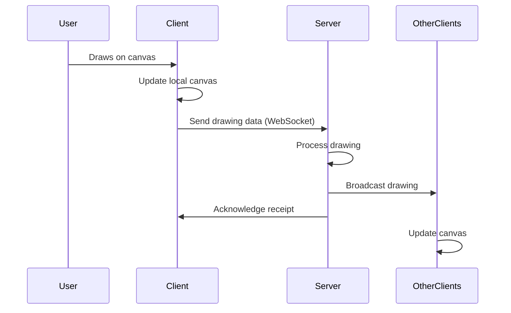

# Application Architecture

## Data Flow Diagram

### High-Level Architecture


*Figure 1: System Architecture Overview*

The diagram above illustrates the main components of the application and their interactions:

1. **Client Application**
   - Handles user input and rendering
   - Manages local state and UI updates
   - Communicates with server via WebSockets

2. **Server**
   - WebSocket server for real-time communication
   - Message router for dispatching events
   - State management for shared canvas
   - History and undo/redo stack management

```
```

### Detailed Data Flow

1. **User Interaction**
   - User draws on the canvas using mouse/touch
   - Drawing events are captured by the Drawing Controller

2. **Local Processing**
   - Points are collected into paths
   - Local canvas is updated immediately for instant feedback
   - Drawing data is batched for network efficiency

3. **Server Communication**
   - Batched drawing data is sent to the server via WebSocket
   - Server validates and processes the drawing data
   - Server broadcasts the drawing to all connected clients

4. **State Synchronization**
   - Client receives drawing updates from server
   - Local state is updated to reflect the shared canvas
   - UI is updated to show other users' cursors and drawings

5. **Conflict Resolution**
   - Vector clocks maintain operation order
   - Last-write-wins for concurrent edits
   - State is periodically synchronized to handle inconsistencies

### Sequence Diagram



## WebSocket Protocol

### Client to Server Messages

1. **Drawing Events**
   ```javascript
   {
     type: 'draw',
     points: [
       { x: Number, y: Number, color: String, size: Number },
       // ... more points
     ],
     userId: String
   }
   ```

2. **Cursor Movement**
   ```javascript
   {
     type: 'cursorMove',
     position: { x: Number, y: Number },
     userId: String
   }
   ```

3. **Undo Action**
   ```javascript
   {
     type: 'undo',
     userId: String
   }
   ```

4. **Clear Canvas**
   ```javascript
   {
     type: 'clearCanvas',
     userId: String
   }
   ```

### Server to Client Messages

1. **Drawing Broadcast**
   ```javascript
   {
     type: 'drawing',
     data: {
       points: Array<{x: Number, y: Number, color: String, size: Number}>,
       userId: String
     }
   }
   ```

2. **User Cursor Update**
   ```javascript
   {
     type: 'userCursorMove',
     userId: String,
     position: { x: Number, y: Number },
     color: String
   }
   ```

3. **Canvas State**
   ```javascript
   {
     type: 'init',
     userId: String,
     userColor: String,
     users: Array<{id: String, color: String}>,
     drawingHistory: Array<Drawing>
   }
   ```

## Undo/Redo Strategy

### Data Structures
```typescript
interface Drawing {
  points: Array<{x: number, y: number, color: string, size: number}>;
  userId: string;
}

class DrawingApp {
  private history: Drawing[] = [];
  private undoneHistory: Drawing[] = [];
  // ...
}
```

### Implementation
1. **Undo**
   - Move last drawing from `history` to `undoneHistory`
   - Redraw all remaining drawings in `history`
   - Broadcast undo action to all clients

2. **Redo**
   - Move last drawing from `undoneHistory` back to `history`
   - Redraw all drawings in `history`
   - Broadcast the redrawn path to all clients

3. **New Drawing**
   - Clear `undoneHistory` (can't redo after new drawing)
   - Add new drawing to `history`

## Performance Decisions

1. **Batched Drawing**
   - **Why**: Reduces WebSocket traffic
   - **How**: Collect points during mouse move and send as a batch

2. **Local Drawing**
   - **Why**: Immediate visual feedback
   - **How**: Draw locally first, then sync with server

3. **Selective Redraw**
   - **Why**: Optimize rendering performance
   - **How**: Only redraw affected portions when possible

4. **Path-based Drawing**
   - **Why**: Smoother curves, less data transfer
   - **How**: Store and transmit paths instead of individual points

5. **Viewport Culling**
   - **Why**: Don't process off-screen drawings
   - **How**: Check bounds before processing drawing events

## Conflict Resolution

1. **Simultaneous Drawing**
   - **Strategy**: Last-write-wins with vector clocks
   - **Implementation**: Each drawing has a timestamp, conflicts resolved by timestamp

2. **Connection Issues**
   - **Strategy**: Automatic reconnection with state sync
   - **Implementation**: On reconnect, server sends full canvas state

3. **Out-of-Order Messages**
   - **Strategy**: Sequence numbers for operations
   - **Implementation**: Each operation has a sequence number, older operations are discarded

4. **Merge Conflicts**
   - **Strategy**: Operational transformation (OT)
   - **Implementation**: Transformations are applied in a way that maintains consistency

5. **State Synchronization**
   - **Strategy**: Periodic full state sync
   - **Implementation**: Every 60 seconds, server broadcasts full canvas state

## Scalability Considerations

1. **Horizontal Scaling**
   - Use Redis for shared state between server instances
   - Implement sticky sessions for WebSocket connections

2. **Load Balancing**
   - Distribute connections across multiple servers
   - Use WebSocket-aware load balancer

3. **Data Persistence**
   - Optional MongoDB integration for saving drawings
   - Periodic auto-save functionality

4. **Rate Limiting**
   - Prevent abuse with rate limiting
   - Max drawing rate per client

